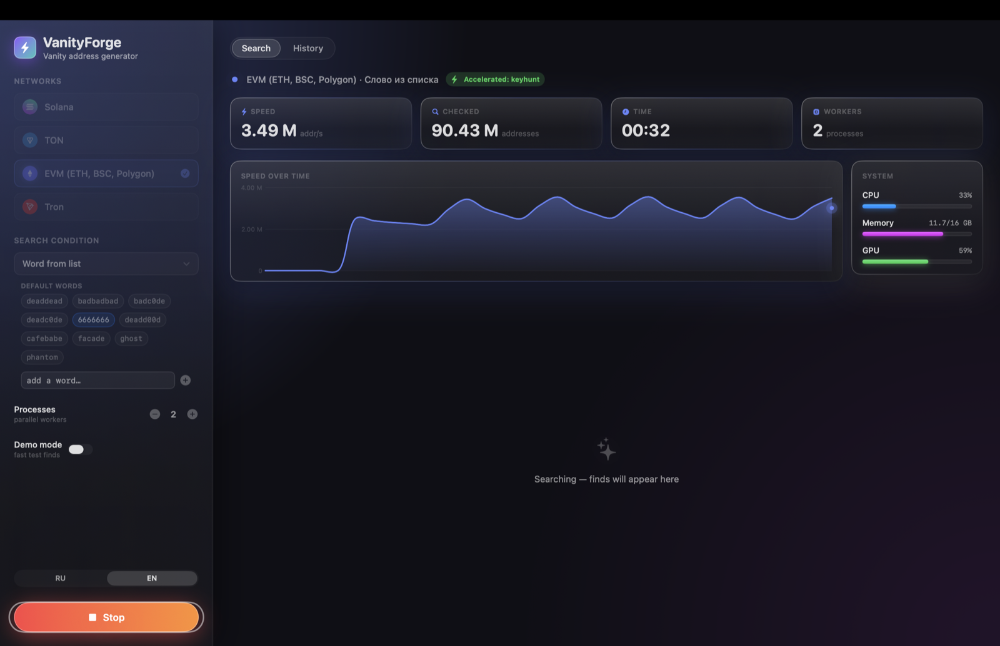

[English](README.md) | **Русский**

# VanityForge

Генератор "красивых" (vanity) адресов криптокошельков: **Solana**, **EVM (ETH, BSC, Polygon и т.п.)**, **Tron**, **TON**. Есть в двух видах — нативное macOS-приложение (live-статистика, график скорости, история находок) и обычный CLI-скрипт, оба на одном Python-движке.



## Возможности

- 4 сети одновременно, готовые пресеты условий (одинаковые символы, палиндромы, слова, последовательности…) + свой паттерн с учётом регистра
- Интерфейс на русском и английском, переключается на лету
- Live-график скорости, загрузка CPU/памяти/GPU
- Показатель редкости и оценка времени до нахождения для каждого условия
- Ускорение EVM-поиска подключается автоматически, без установки чего-либо ещё (подробнее ниже)
- История всех находок, разложенная по сетям и условиям

## Установка

### Вариант 1 — .dmg (проще всего)

1. Скачайте `VanityForge.dmg` из [Releases](../../releases)
2. Откройте, перетащите `VanityForge.app` в `Applications`
3. При первом запуске — правый клик по приложению → "Открыть" (оно не подписано сертификатом Apple Developer, Gatekeeper один раз спросит подтверждение)

Python-рантайм, все зависимости и ускоритель EVM-поиска уже упакованы внутри `.app` — доустанавливать ничего не нужно.

### Вариант 2 — собрать из исходников

Понадобятся:
- Command Line Tools для Xcode (`xcode-select --install`) — для сборки Swift
- [Rust](https://rustup.rs) — для сборки `ethvanity` (опционально: без него приложение всё равно работает, просто без CPU-ускорения EVM-поиска)

Python отдельно ставить не нужно — сборочный скрипт сам скачивает самодостаточный рантайм (не трогает системный Python и никакие ваши venv).

```bash
git clone git@github.com:DanilKhmyrov/VanityForge.git
cd VanityForge/VanityForge
./Scripts/make_app.sh      # соберёт VanityForge.app
open VanityForge.app

# или сразу .dmg для раздачи:
./Scripts/make_dmg.sh
```

## Как устроено ускорение EVM-поиска

Поиск vanity-адресов упирается в скорость перебора ключей. Для EVM-сетей (адрес и приватный ключ одинаковые что для Ethereum, что для BSC/Polygon/Arbitrum и любой другой EVM-совместимой сети) в приложении два уровня, оно само выбирает лучший из доступных:

1. **`keyhunt`**, если установлен отдельно и виден в `PATH` — сторонний инструмент, у некоторых сборок есть GPU/OpenCL-режим, обычно самый быстрый вариант. Приложение не устанавливает и не поставляет его само: происхождение и лицензия конкретных модифицированных сборок `keyhunt`, которые ходят по сети, не всегда понятны, и раздавать чужой непроверенный бинарник вместе со своим приложением — плохая идея.
2. **[`ethvanity`](ethvanity)** (лицензия GPL-3.0, исходники прямо в этом репозитории) — написанный специально для этого проекта CPU-ускоритель на Rust. Вместо полного умножения точки на эллиптической кривой для каждого кандидата (как в обычной генерации) он считает следующий адрес сложением точек — `P(k+1) = P(k) + G` — через безопасный аудированный API крейта `secp256k1`, плюс сравнение по префиксу идёт по полубайтам без форматирования каждого кандидата в hex-строку. Даёт ~7x по сравнению с наивной генерацией на Python/coincurve. Собирается автоматически в `make_app.sh`/`make_dmg.sh` и кладётся внутрь `.app` — работает у всех "из коробки", без единой ручной команды.

Если не найдено ни то, ни другое (или для остальных сетей — они не поддерживают GPU/ethvanity-режим), используется обычная многопроцессная Python-генерация.

## CLI-версия (без приложения)

Если графический интерфейс не нужен и хочется просто консольный скрипт:

```bash
python3 -m venv venv
source venv/bin/activate
pip install -r requirements.txt
python3 main.py <сети> [условие]
```

### Примеры

```bash
python3 main.py sol same5        # Solana, 5 одинаковых подряд
python3 main.py all all          # все сети, любое условие
python3 main.py eth,sol word     # EVM и Solana, поиск по словам
```

## Доступные сети

- `sol` — Solana
- `ton` — TON
- `eth` — EVM (ETH, BSC, Polygon и т.п. — один и тот же адрес/ключ работает во всех)
- `trx` — Tron
- `all` — все сети одновременно

## Условия поиска

### Одинаковые символы
- `same5` / `same6` / `same7` / `same8` / `same9` — N одинаковых подряд

### Конец адреса
- `suffix4`…`suffix8` — последние N символов одинаковые

### Начало адреса
- `prefix4`…`prefix8` — первые N символов одинаковые

### Последовательности
- `seq12345` / `seq123456` — числовая последовательность
- `ascending4` / `ascending5`, `descending4` / `descending5`

### Палиндромы
- `palindrome6` / `palindrome8` / `palindrome12` / `palindrome20`, `symmetric`

### Повторы
- `repeat2x3` / `repeat3x3`

### Слова
- `word` — адрес содержит слово из списка

### Свой паттерн
- В приложении — произвольная строка (префикс/суффикс/содержит), с опцией учитывать регистр

### Любое
- `all` — любое условие из всех выше

### Для TON (base64-адреса)
- `same7` / `prefix5` / `pairs10` / `repeat2x3` / `word`

## Осторожно со своим паттерном

Чем короче и "популярнее" паттерн, тем чаще он совпадает — короткий 2-3-символьный префикс встречается очень часто (при hex-алфавите из 16 символов двухсимвольный префикс — это 1 адрес из 256). Приложение ограничивает число детально обрабатываемых находок за сессию, но на очень широких паттернах всё равно стоит быть аккуратнее: начинайте с 4+ символов и не держите поиск запущенным подолгу, если не уверены в редкости паттерна.

## Структура сохранения

```
results/
├── sol/
│   ├── same5/
│   │   └── 20250205_143022_GxCRRRRR.txt
│   └── word/
├── eth/
├── trx/
└── ton/
```

Файл содержит: сеть, адрес, приватный ключ, условия, время нахождения.

**Приватные ключи хранятся в этих файлах в открытом виде.** Это инструмент для генерации адресов, а не кошелёк — переносите найденные ключи в надёжное хранилище (аппаратный кошелёк, менеджер паролей) и не держите `results/` дольше необходимого.

## Производительность (M4 Mac, 1 ядро)

| Сеть | addr/s | Алгоритм |
|------|--------|----------|
| Solana | ~15 000 | Ed25519 (solders) |
| EVM | ~41 000 | secp256k1 (coincurve) |
| EVM (`ethvanity`) | ~280 000 | secp256k1, инкрементальное сложение точек |
| Tron | ~40 000 | secp256k1 + Base58 |
| TON | ~50 000 | tonsdk |

Подробнее — [PERFORMANCE.md](PERFORMANCE.md).

## Лицензия

[GPL-3.0](LICENSE)
