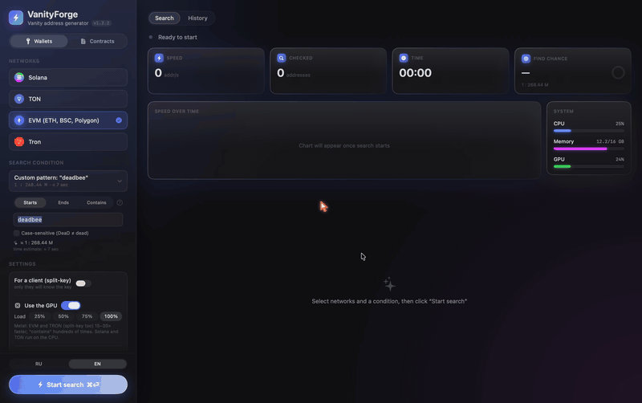

[English](README.md) | **Русский**

# VanityForge

Генератор «красивых» (vanity) адресов: **EVM (ETH, BSC, Polygon и т.п.)**, **Tron**, **Solana**, **TON**, а также красивых **адресов смарт-контрактов** (CREATE2/CREATE3). Нативное macOS-приложение и консольная версия на одних и тех же движках; поиск EVM и TRON идёт на видеокарте Apple Silicon.



## Возможности

- **Кошельки:** пресеты (10 одинаковых символов в начале или в конце, DEAD…DEAD, слово из своего списка) или свой шаблон — начало, конец или где угодно, с учётом регистра или без
- **Видеокарта (Metal):** EVM и TRON — десятки миллионов адресов в секунду; нагрузку можно ограничить до 25/50/75%
- **Контракты:** подбор salt для CREATE2 и CREATE3 (CreateX) — нули в начале, нулевые байты, префикс, флаги хука Uniswap v4
- **Split-key:** красивый EVM/TRON-адрес для заказчика, который присылает только публичный ключ, — приватный ключ знает только он
- Точные оценки редкости и времени, шанс уже найти; невозможные шаблоны помечаются до старта
- Карточки находок с подсветкой совпадения, QR-кодом и ссылкой на обозреватель; история всех находок
- Mac не засыпает во время поиска, счётчик находок на иконке в Dock, уведомления; интерфейс на русском и английском

## Установка

**Из релиза:** скачайте `VanityForge.dmg` из [Releases](../../releases) и перетащите приложение в `Applications`. Приложение не нотаризовано: при первом запуске — Системные настройки → Конфиденциальность и безопасность → «Открыть всё равно». Python-рантайм и все движки уже внутри `.app`.

**Из исходников:** нужны Xcode Command Line Tools (`xcode-select --install`) и [Rust](https://rustup.rs) для движков. Python сборочный скрипт скачает сам, как отдельный рантайм.

```bash
git clone git@github.com:DanilKhmyrov/VanityForge.git
cd VanityForge/app
./scripts/make_app.sh      # VanityForge.app (./scripts/make_dmg.sh — .dmg)
open VanityForge.app
```

## Скорость (MacBook Air M4)

| Что | Движок | Адресов/с |
|---|---|---|
| EVM: начало / конец / где угодно | GPU, `metalvanity-evm` | ~90 млн |
| TRON: начало | GPU | ~60 млн |
| TRON: конец / где угодно | GPU | ~25 млн |
| EVM без GPU | CPU, `ethvanity` | ~10 млн |
| Solana | CPU, 10 процессов | ~50–90 тыс |
| TON, новый кошелёк | CPU, 10 процессов | ~120 |
| TON, подкошелёк существующего ключа | CPU, `ethvanity` | ~7,5 млн |
| Контракты CREATE2 / CREATE3 | GPU, `metalvanity` | ~170 млн / ~60 млн |

Цифры — для холодного Mac: MacBook Air без вентилятора через несколько минут нагрузки замедляется (видели падение GPU с ~90 до 40–60 млн/с).

## Как устроен поиск

EVM и TRON идут на видеокарту; при выключенной видеокарте EVM ищет `ethvanity` (Rust, CPU, тот же приём с окнами и одной пакетной инверсией на 1025 точек). Solana и TON считаются на процессоре. Python — только запасной вариант, если движки не собраны.

- **`metalvanity-evm`** ([engines/metalvanity-evm](engines/metalvanity-evm)) — secp256k1 и keccak в ядре Metal. Каждый поток проверяет окно точек Q ± j·G, одна пакетная инверсия на 513 точек. Тот же проход проверяет TRON: начало base58 превращается в диапазон чисел, конец и середина адреса проверяются через sha256d и base58 прямо на видеокарте.
- Каждая находка перед показом дважды пересчитывается из приватного ключа на CPU (libsecp256k1, затем coincurve). Каждый поток GPU стартует со своего случайного ключа, все старты обновляются раз в 30 с.
- **TON:** новый ключ выводится из сид-фразы (PBKDF2), поэтому всего ~120 адресов/с. Гораздо быстрее искать красивый адрес для уже существующего кошелька по номеру подкошелька: 2^32 вариантов примерно за 10 минут, ключ и сид-фраза те же (`python3 python/bridge.py --ton-subwallet <публичный ключ или адрес> --custom prefix:ABC`).

## Контракты (CREATE2 / CREATE3)

Адрес CREATE2-контракта — `keccak256(0xff ++ factory ++ salt ++ keccak256(code))[12:]`, VanityForge перебирает salt. **CREATE3** через CreateX от кода не зависит: намайнил salt один раз — разворачиваешь любой контракт. Приватных ключей нет: результат — salt, его можно отдать заказчику как есть. Первые 20 байт salt — кошелёк заказчика, поэтому чужой salt никто не использует и не перехватит.

```bash
python3 python/create2.py --init-code-hash 0x… --caller 0x… --goal leading --min 4
python3 python/create2.py --kind create3 --caller 0x… --goal leading --min 4
```

`--goal`: `leading`, `zeros`, `prefix` (с `--prefix dead`), `hook` (с `--hook-flags 00C0`); `--factory`: `immutable` (по умолчанию), `arachnid` или любой адрес.

## Split-key

Заказчик запускает `python3 python/splitkey.py new` и присылает только публичный ключ. Приложение ищет добавку k, при которой адрес точки P + k·G красивый; заказчик сам собирает ключ: `python3 python/splitkey.py combine <свой приватный ключ> <k> [eth|trx]`. Работает для EVM и TRON, в том числе на видеокарте.

## Консольная версия

```bash
python3 -m venv venv && source venv/bin/activate
pip install -r python/requirements.txt
python3 python/main.py eth prefix10     # EVM, 10 одинаковых символов в начале
python3 python/main.py eth,trx word     # EVM и Tron, слово из списка
```

Сети: `eth`, `trx`, `sol`, `ton`, `all`. Условия: `prefix10`, `suffix10`, `deadprefixsuffix`, `word`, `all`; для TON — `same6`, `prefix5`, `pairs8`, `repeat2x4`, `word`. Консольная версия использует те же движки, что и приложение (видеокарта для EVM и TRON); свой шаблон задаётся в приложении.

## Где лежат находки

Приложение хранит их в `~/Library/Application Support/VanityForge/results/` (кнопка «Папка с находками»), консольная версия — в `results/` в текущей папке: по файлу на находку с сетью, адресом, ключом (или salt / добавкой k), условиями и временем.

**Приватные ключи хранятся в открытом виде.** Это генератор, а не кошелёк: переносите нужные ключи в надёжное хранилище и не держите `results/` дольше необходимого.

## Структура репозитория

```
app/                     macOS-приложение (SwiftUI) и скрипты сборки (app/scripts)
engines/ethvanity/       Rust, CPU: кошельки EVM, CREATE2/CREATE3, TON-подкошельки
engines/metalvanity/     Swift + Metal, GPU: CREATE2/CREATE3
engines/metalvanity-evm/ Rust + Metal, GPU: кошельки EVM и TRON
python/                  bridge.py (связь приложения с движками), консольный main.py, create2/splitkey/tonsub
docs/                    roadmap, демо
```

## Лицензия

[GPL-3.0](LICENSE)
